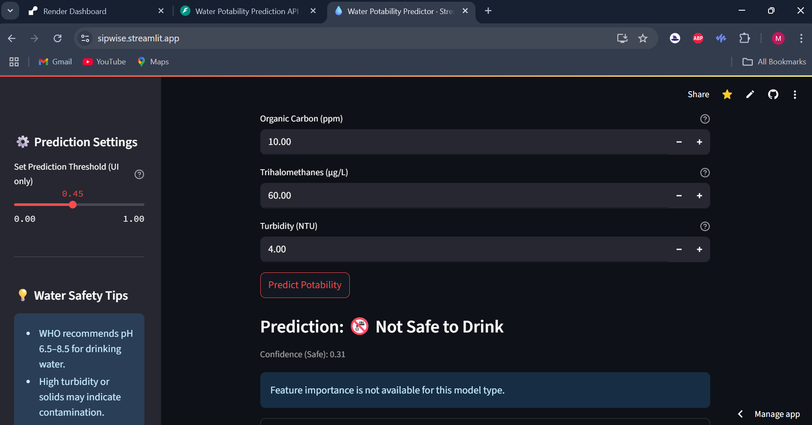

# 💧 AI-Powered Water Potability Predictor

[](https://sipwise.streamlit.app)
[](https://water-quality-ai.onrender.com/docs)

---

## 🌟 Overview
This project predicts whether water is safe to drink (potable) based on its chemical properties, using a machine learning model. It features a modern Streamlit web app and a REST API (FastAPI), both cloud-deployed for easy access. The goal is to provide a low-cost, accessible digital tool to help communities and individuals assess water safety, supporting UN SDG 6: Clean Water and Sanitation.

## 🚀 Features
- **User-friendly Streamlit Web App** for interactive predictions and data exploration
- **REST API (FastAPI)** for programmatic access to predictions
- **Model Training Pipeline** with multiple algorithms, cross-validation, and evaluation
- **Cloud Deployment**: Streamlit Cloud (UI) and Render (API)
- **Unit Testing** for core logic
- **Data Visualizations** and water safety tips
- **Easy extensibility** for new features or models

## 🧪 Dataset
- **Source:** [Kaggle – Water Potability](https://www.kaggle.com/datasets/adityakadiwal/water-potability)
- **Features:**
  - `pH`, `Hardness`, `Solids`, `Chloramines`, `Sulfate`, `Conductivity`, `Organic Carbon`, `Trihalomethanes`, `Turbidity`
  - **Target:** `Potability` (1 = safe, 0 = not safe)

## 📸 App Screenshot
 <!-- Replace with your screenshot path -->

---

## ⚡ Live Demo
- **Streamlit App:** [Open App](https://sipwise.streamlit.app)
- **API Docs:** [Open FastAPI Swagger UI](https://water-quality-ai.onrender.com/docs)

---

## 🏁 Getting Started

### 1. Clone the Repo
```bash
git clone https://github.com/yourusername/water-quality-ai.git
cd water-quality-ai
```

### 2. Install Dependencies
```bash
pip install -r requirements.txt
```

### 3. Train the Model (Optional)
```bash
python train_model.py
```

### 4. Run the Streamlit App Locally
```bash
streamlit run app.py
```

### 5. Run the FastAPI API Locally
```bash
uvicorn api:app --reload
```

---

## 🌐 Cloud Deployment

### Deploy FastAPI API to Render
- See [Render deployment guide](https://render.com/docs/deploy-fastapi)
- Use Start Command: `uvicorn api:app --host 0.0.0.0 --port 10000`

### Deploy Streamlit App to Streamlit Cloud
- See [Streamlit Cloud docs](https://docs.streamlit.io/streamlit-community-cloud/deploy-your-app)
- Set `API_URL` in `app.py` to your Render API URL

---

## 🔗 Example API Usage

### cURL
```bash
curl -X POST "https://water-quality-ai.onrender.com/predict" \
  -H "Content-Type: application/json" \
  -d '{
    "ph": 7.0,
    "Hardness": 150.0,
    "Solids": 20000.0,
    "Chloramines": 7.0,
    "Sulfate": 300.0,
    "Conductivity": 500.0,
    "Organic_carbon": 10.0,
    "Trihalomethanes": 60.0,
    "Turbidity": 4.0
  }'
```

### Python
```python
import requests
payload = {
    "ph": 7.0,
    "Hardness": 150.0,
    "Solids": 20000.0,
    "Chloramines": 7.0,
    "Sulfate": 300.0,
    "Conductivity": 500.0,
    "Organic_carbon": 10.0,
    "Trihalomethanes": 60.0,
    "Turbidity": 4.0
}
response = requests.post("https://water-quality-ai.onrender.com/predict", json=payload)
print(response.json())
```

---

## 🧠 Model & Methodology
- Multiple algorithms compared (Random Forest, XGBoost, LightGBM, SVM)
- Cross-validation and hyperparameter tuning
- Model evaluation: Accuracy, Precision, Recall, F1, ROC-AUC
- Ensemble methods for robustness
- Model exported as `water_quality_model.pkl`

---

## 🧪 Testing & Quality
- Unit tests for data preprocessing, model loading, and prediction
- Modular code with clear docstrings and type hints
- (Optional) GitHub Actions for CI/CD

---

## 🤝 Contributing
Contributions are welcome! To contribute:
1. Fork the repo
2. Create a new branch (`git checkout -b feature/your-feature`)
3. Commit your changes (`git commit -am 'Add new feature'`)
4. Push to the branch (`git push origin feature/your-feature`)
5. Open a Pull Request

---

## 📄 License
This project is licensed under the MIT License. See [LICENSE](LICENSE) for details.

## 📬 Contact
For questions or suggestions, please open an issue or contact [your.email@example.com](mailto:your.email@example.com).

---
This project supports UN SDG 6: Clean Water and Sanitation by providing a low-cost digital tool to detect water safety.